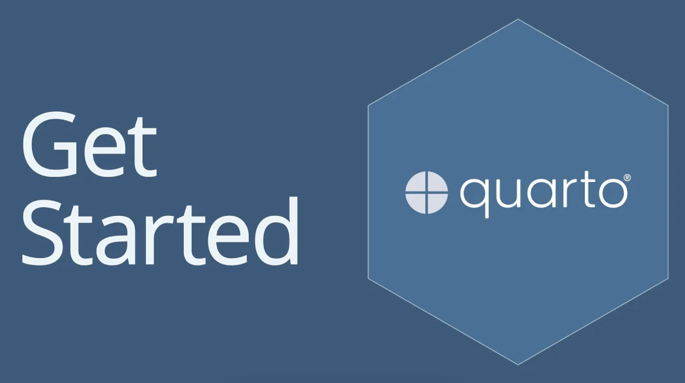

```{=html}
<div style="display: grid; grid-template-columns: 1fr;">
  <div>
    
  </div>
</div>

<div style="margin-bottom: 2rem;"></div>
```

## Why Quarto?

When I originally started to create my portfolio website, I tested a variety of site builders for simplicity (Wix Website Builder, Squarespace, etc.). Though it was an easy setup to get started, I despised how restrictive the site builders were in terms of limiting creativity. On the other hand, it has been several years since programming with HTML and CSS in undergrad, and it would be a daunting task to create an entire website from scratch. My colleague and friend [Emily Port](https://www.emilyport.com/) (check her out; she is amazing and incredibly intelligent) told me how she built her website using static site generators (SSG). Her website utilizes an SSG called [Hugo](https://gohugo.io/), but while doing some more research, some developers discussed how they were moving away from Hugo and instead using [Quarto](https://quarto.org/). As someone who has not worked with either of these frameworks, I decided to go with Quarto, as people described the setup and rendering process as simple and easy to update.

## Getting Started

The workflow itself isn't that hard to follow, thankfully, especially with the [guide](https://quarto.org/docs/websites/) they have on their website and the [video](https://www.youtube.com/watch?v=l7r24gTEkEY) tutorials they have on YouTube. 

Each page is mainly going to have two files: a Quarto Markdown Document (qmd) file where you can insert detailed documentation and a YML file that configures the frontmatter and website options for each page. To customize the pages, you can include a Sassy CSS (SCSS) file to program attributes such as font type, color themes, and special decorators.

Before previewing the website, you will need to render the page first using the render command:

```bash
quarto render
```

You can also render specific files instead of the entire directory by specifying the file after the render keyword. After rendering the pages, you are able to preview the website on a local host using the following:

```bash
quarto preview
```

I recommend checking out their page of tutorials and tips to integrate how to implement website attributes, including navigation and tools.

## Challenge: Customizing Pages

The main challenge that I faced when customizing the website was being restricted by the original template. I think the template is great as a starting foundation, but as I added more information, I brainstormed ideas of how I wanted to display certain items and was inevitably roadblocked by the template. Even though you are able to manipulate the pages within the markdown files, the rendering command is responsible for creating the HTML output. All I had to do then was figure out how to inject code snippets within the files so that the rendering command would input the code into the HTML files.

Thankfully, this was simpler than I could have imagined to implement. For instance, I inserted the above bash commands but used this syntax:

````markdown
```
INJECT CODE HERE
```
````

Using this feature, I am able to insert HTML code into the markdown files to customize pages more freely. For instance, this is how I was able to implement my carousel image feature in the [Physically-Based Visual Effects](/projects/volume/index.qmd) project page. This makes me excited to pick up HTML and CSS once again to hopefully add more cool features in the future.

## Deploying the Website using GitHub Pages

To host the site, I use [GitHub Pages](https://docs.github.com/en/pages) which was surprisingly a lot simpler than I initially imagined to deploy the website. There are multiple ways that you can publish the files to GitHub Pages. I chose to render the files on my local machine and then configure a GitHub repository to publish that directory every time I update the render. By just adding the directory to the root YAML file, I can commit new changes to the GitHub repository, push the updated files, and then the changes are reflected on the site within a matter of minutes.

Overall, as someone who was initially scared of web development and the idea that I needed to be an expert in multiple programming languages and frameworks, Quarto helped me realize that there are more simple alternatives while not sacrificing creative freedoms. Go check out Quarto or other SSG frameworks if you want to start exploring web development.