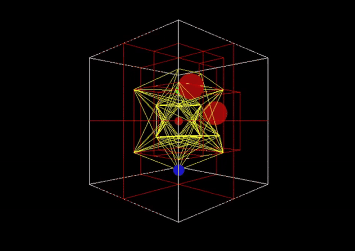
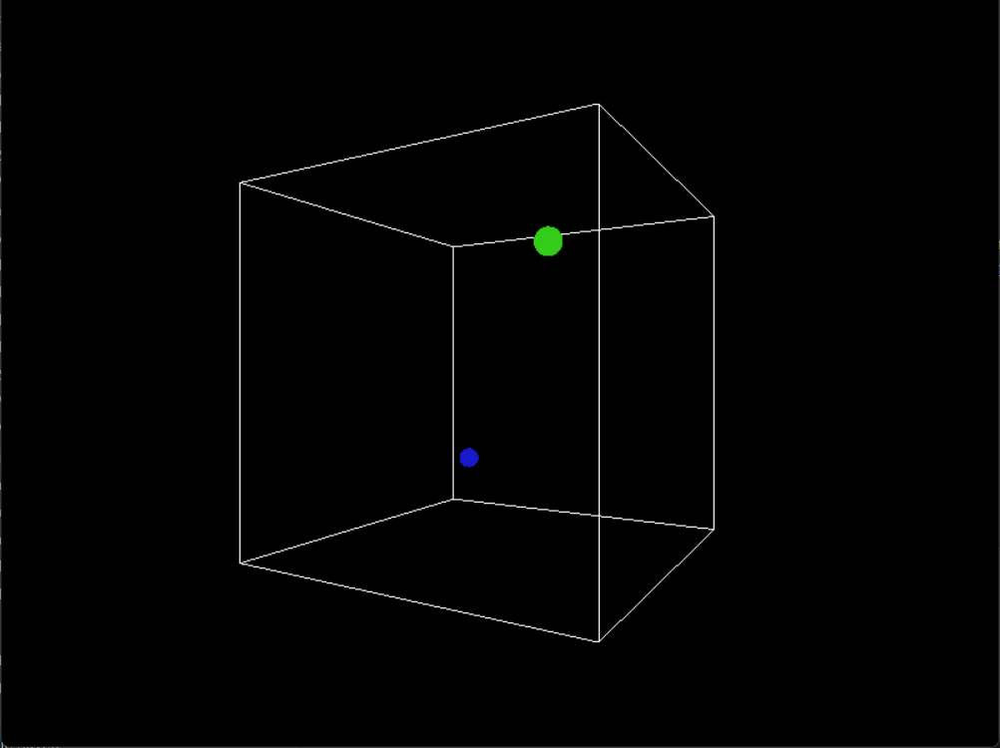
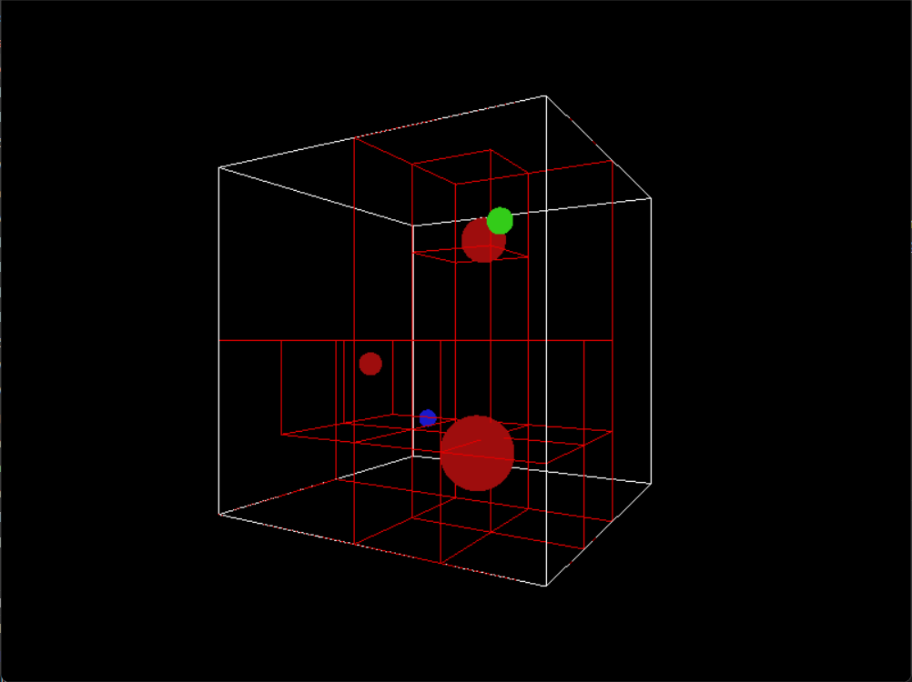
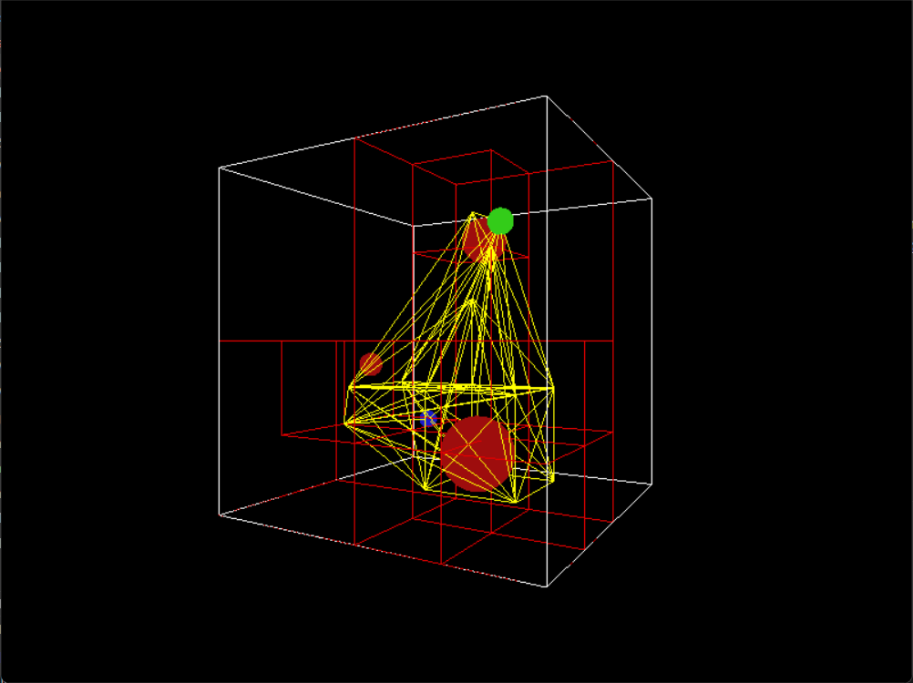
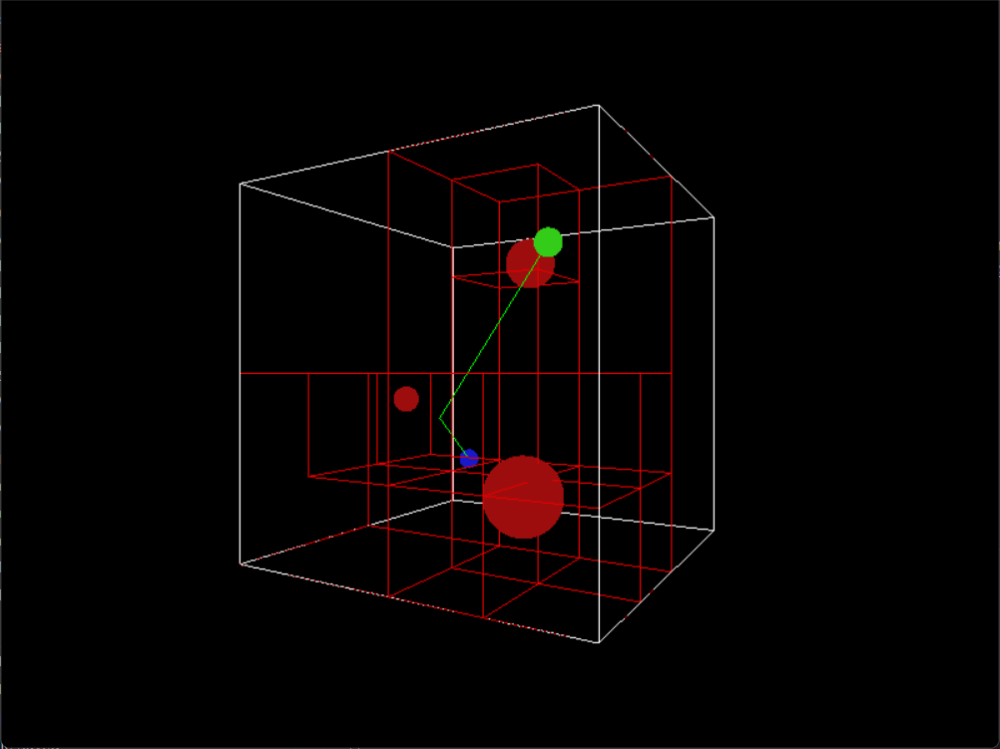

<div style="margin-bottom: 3rem;"></div>

```{=html}
<div style="display: grid; grid-template-columns: 1fr;">
  <div>
    
    <p class= "image-caption">Three Dimensional Pathfinding Demo</p>
  </div>
</div>

<div style="margin-bottom: 2rem;"></div>
 
<button class="github_button" onclick="window.location.href = 'https://github.com/christopher-jacobs/3D_AStar';">
  <i class = "bi bi-github"></i>&nbsp; View on GitHub
</button>

```

<div style="margin-bottom: 3rem;"></div>

## Project Overview

When initially researching motion planning tools developed within Unreal Engine 4.27 at the time (2023), I noticed that there was a significant lack of free plugins available. I decided to utilize the opportunity and familiarize myself with C++ by designing and implementing this project. I developed a three-dimensional pathfinding tool to help visualize motion paths for autonomous agents.

For this project, I utilized C++ and Legacy OpenGL to develop and visualize the application. The start and end goals are predefined, but as the user, you are able to define the location and radius of objects within the voxel space. I utilized voxel octrees to parse through the voxel space in a computationally effective manner. Once the obstacles have been placed, the user can then define the roadmap and finally activate A* to locate the shortest path from the start to the goal.


**Technologies:** C++, Legacy OpenGL, GLUT


## Technical Implementation

- **A* Algorithm:** The user is able to place spherical objects with different radi at different locations within the grid. Once they are satisfied, a roadmap will be created using the voxels that have obstacles identified. Using their vertices, the A* algorithm will parse through the roadmap to find the shortest path possible.

- **Voxel Octrees:** I want to balance the ability to visualize the obstacles, voxels, roadmap, and path with computational efficiency. Therefore, I leveraged a voxel octree data structure to represent the 3D regions, similarly to tree data structures.

- **OpenGL/GLUT:** To visualize the scene I used OpenGL and GLUT tools. Using multiple methods and keyboard controls, I updated the viewing buffers with transformation matrices for the camera so the user can have a 360&deg; view of the scene.

## Gallery

```{=html}
<div style="display: grid; grid-template-columns: 1fr 1fr; gap: 2rem;">

  <div>
    
    <p class= "image-caption">Base Scene</p>
  </div>

  <div>
    
    <p class= "image-caption">Obstacles & Voxels</p>
  </div>

  <div>
    
    <p class= "image-caption">Completed Roadmap</p>
  </div>

  <div>
    
    <p class= "image-caption">Calculated Path</p>
  </div>

</div>
```

## Future Work
- Add Windows and MacOS capabilities to build and execute the repository.
- Extend the final path to interpolate using a spline or bezier curve for a better, more realistic simulation.
- Include animation of an object using the path interpolation to show proof of concept.
- Research further to make the program more computationally efficient.
- Explore modern OpenGL.
- Possibly look at integrating the tool within Unreal Engine.
