<div style="margin-bottom: 3rem;"></div>

```{=html}
<div style="display: grid; grid-template-columns: 1fr;">
  <div>
    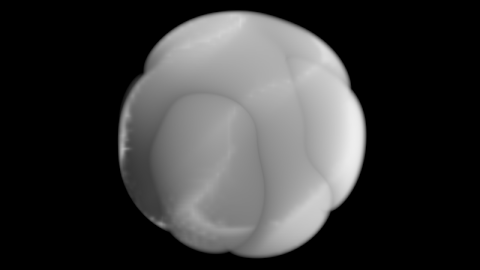
    <p class= "image-caption">Pyroclastic Sphere Wedge</p>
  </div>
</div>

<div style="margin-bottom: 2rem;"></div>

<button class="github_button" onclick="window.location.href = 'https://github.com/christopher-jacobs/PhysicallyBasedVisualEffects';">
  <i class = "bi bi-github"></i>&nbsp; View on GitHub
</button>
```

<div style="margin-bottom: 3rem;"></div>

## Project Overview

I developed a physically-accurate volumetric rendering system in C++ for creating visual effects commonly used in feature film production. The pipeline utilizes a ray marching algorithm to evaluate implicit volumes and deep shadow maps, generating realistic atmospheric effects including noise clouds, pyroclastic volumes,  wisps, terrain elements, and level sets.

**Technologies:** C++, OpenImageIO, OpenEXR, SWIG

## Technical Implementation
The rendering pipeline utilizes a multithreaded ray marching approach with physically-based scattering and shadowing models. Key technical components include:

- **Flexible rendering:** Users can render within a sparse grid for bounded rendering or utilize unbounded volume evaluation depending on production requirements.

- **Dual ray marcher architecture:** Separate ray marchers to evaluate deep shadow maps and render volumetric features, enabling physically-accurate light with shadow and scattering properties.

- **Adaptive step-size optimization:** Dynamic step adjustment to balance performance optimization with rendering quality

## Gallery

Below are three core effects that demonstrate the renderer's capabilities with implicit volumes and procedural noise:


### Fractal-Summed Perlin Noise

Perlin Noise that can be modified and animated to mimick nature known as Fractal-Sum Perlin Noise. Includes modifiable parameters such as frequency, amplitude, roughness, frequency jump, and octaves to create more complex effects.

```{=html}
<div class="two_image_diagram">

  <div>
    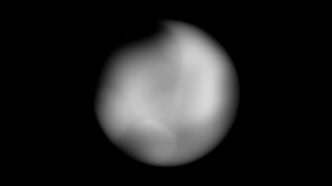
    <p class= "image-caption">Fractal-Sum Noise Slice</p>
  </div>

  <div>
    <div id="noiseCarousel" class="carousel slide">
      
      <div class="carousel-inner">
        <div class="carousel-item active">
          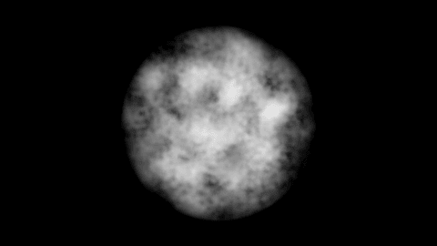
        </div>
        <div class="carousel-item">
          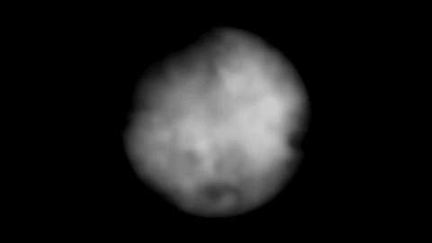
        </div>
        <div class="carousel-item">
          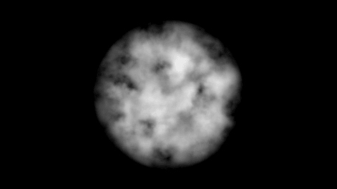
        </div>
      </div>
      <p class= "image-caption">Fractal-Sum Noise Freeze Frames</p>

      <button class="carousel-control-prev" type="button" data-bs-target="#noiseCarousel" data-bs-slide="prev">
        <span class="carousel-control-prev-icon"></span>
      </button>

      <button class="carousel-control-next" type="button" data-bs-target="#noiseCarousel" data-bs-slide="next">
        <span class="carousel-control-next-icon"></span>
      </button>

    </div>
  </div>

</div>
```

### Pyroclastic Effects

Pyroclastic noise fields combined with implicit functions using iterative closest-point to create trailing smoke, cloud formations, and explosive noise.

```{=html}
<div class="two_image_diagram">
  <div>
    
    <p class= "image-caption">Pyroclastic Sphere Slice</p>
  </div>
  <div>
    <div id="pyroCarousel" class="carousel slide">
      <div class="carousel-inner">
        <div class="carousel-item active">
          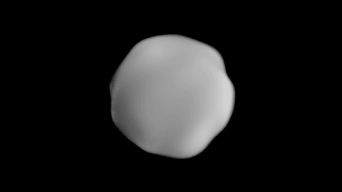
        </div>
        <div class="carousel-item">
          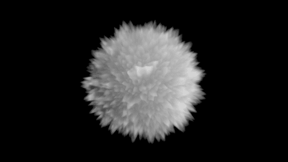
        </div>
        <div class="carousel-item">
          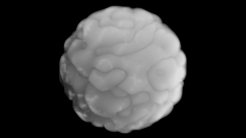
        </div>
      </div>
      <p class= "image-caption">Pyroclastic Sphere Freeze Frames</p>
      <button class="carousel-control-prev" type="button" data-bs-target="#pyroCarousel" data-bs-slide="prev">
        <span class="carousel-control-prev-icon"></span>
      </button>
      <button class="carousel-control-next" type="button" data-bs-target="#pyroCarousel" data-bs-slide="next">
        <span class="carousel-control-next-icon"></span>
      </button>
    </div>
  </div>
</div>
```

### Wisps

Particle-based volume generation where millions of particles are stamped and baked into a density grid to create wispy, flowing volumes. These particles can also be constrained to spline paths and contribute to water-like or magical effects.

```{=html}
<div class="two_image_diagram">
  <div>
    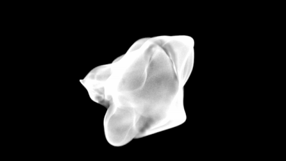
    <p class= "image-caption">Wisp Slice</p>
  </div>
  <div>
    <div id="wispCarousel" class="carousel slide">
      <div class="carousel-inner">
        <div class="carousel-item active">
          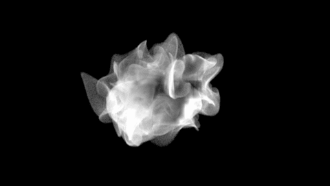
        </div>
        <div class="carousel-item">
          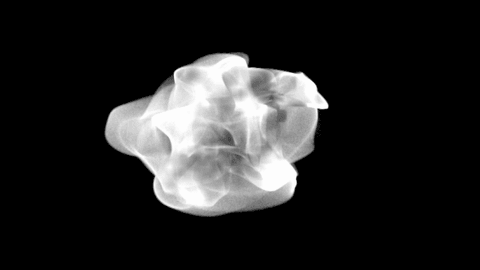
        </div>
        <div class="carousel-item">
          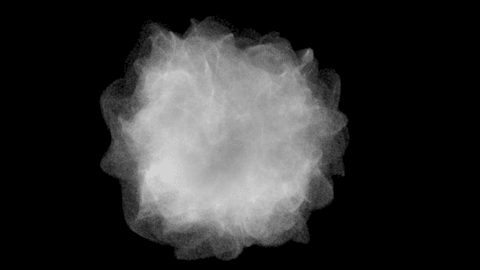
        </div>
      </div>
      <p class= "image-caption">Wisp Freeze Frames</p>
      <button class="carousel-control-prev" type="button" data-bs-target="#wispCarousel" data-bs-slide="prev">
        <span class="carousel-control-prev-icon"></span>
      </button>
      <button class="carousel-control-next" type="button" data-bs-target="#wispCarousel" data-bs-slide="next">
        <span class="carousel-control-next-icon"></span>
      </button>
    </div>
  </div>
</div>
```