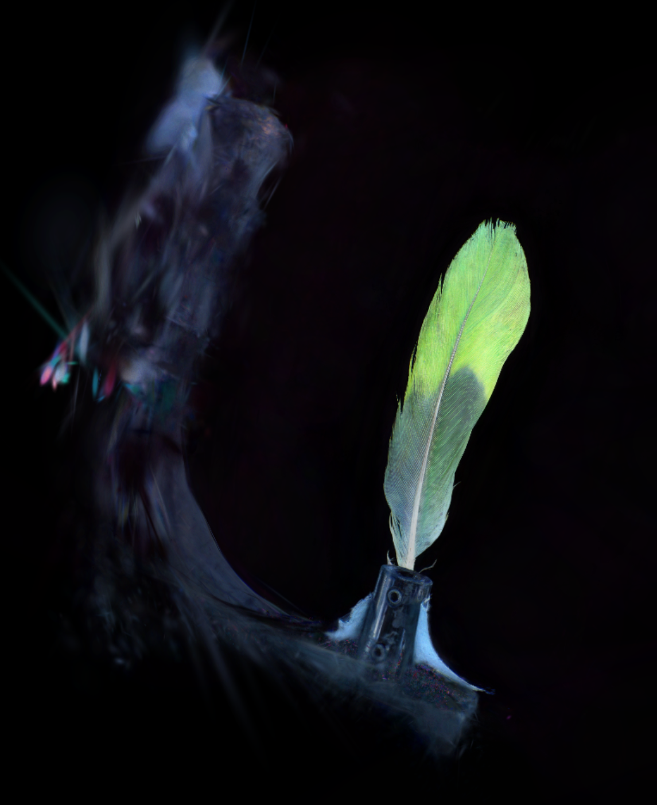
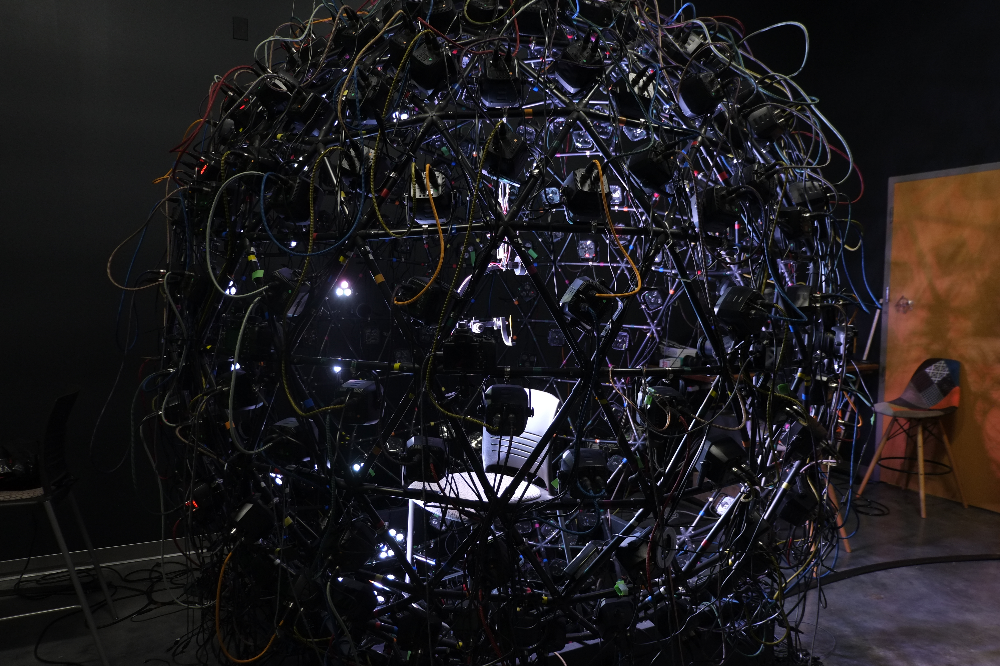

```{=html}
<h2 class="research-title">
  Current Research | 
  <a href="../past_research/index.qmd">
  Past Research </a>
</h2>
```

### Neural Rendering for Object Capture and Analysis

```{=html}
<div style="display: grid; grid-template-columns: 1fr 1fr; grid-template-rows: auto auto; column-gap: 2rem; row-gap: 2rem; margin: 2rem 0; max-width: 1200px;">
  <div style="grid-row: 1 / 3;">
    
    <p class="image-caption">Feather Gaussian Splat (30k iterations)</p>
  </div>
  <div>
    <video style="width: 100%; border-radius: 8px; box-shadow: 0 4px 6px rgba(0,0,0,0.1);" autoplay loop muted playsinline>
        <source src="./images/FeatherTestGS.mp4" type="video/mp4">
        Your browser does not support the video tag.
    </video>
    <p class="image-caption">Gaussian Splat Full View</p>
  </div>
  <div>
    
    <p class="image-caption">Variable Illumination Sphere (VarIS)</p>
  </div>
</div>
```   
<div style="margin-bottom: 2rem;"></div>

**Advisor:** Dr. Eric Patterson | Clemson University   
**Topics:** Gaussian Splatting, Machine Learning, Material Capture, Facial Analysis   

<div style="margin-bottom: 2rem;"></div>

As a possible avenue for my dissertation, I am currently exploring neural inference techniques to improve vertex initialization in 3D Gaussian Splatting for facial and object reconstruction. This work focuses on leveraging multi-view feature detection to establish consistent point correspondences without the need for COLMAP algorithms that could be too expensive or incorrect.

In the preliminary stages of our work, we were able to capture and render a Gaussian Splat model of this feather using Agisoft MetsShape to export COLMAP data. In total it took three days to render, 30,000 iterations, and over one million gaussians were left to be rasterized. Not only does this show remarkable possibility, it gives us a baseline to compare our future method that bypasses COLMAP.