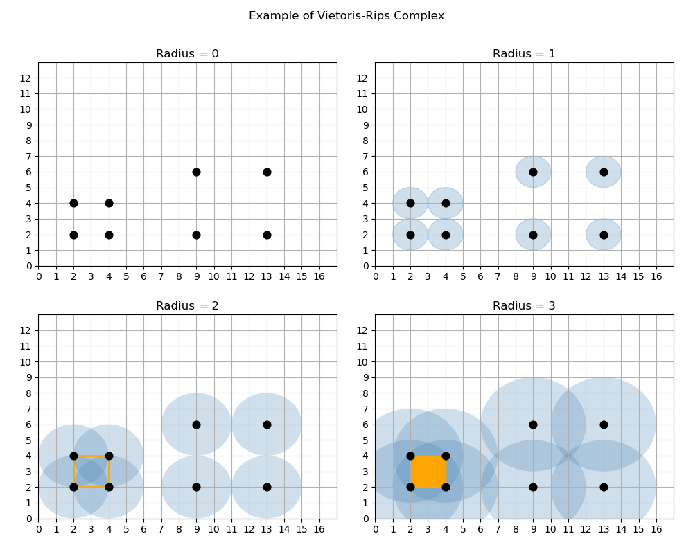
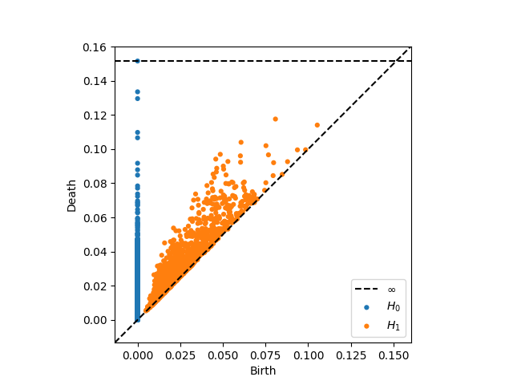

### Neural Rendering for Object Capture and Analysis

```{=html}
<div style="display: grid; grid-template-columns: 1fr 1fr; grid-template-rows: auto auto; column-gap: 2rem; row-gap: 2rem; margin: 2rem 0; max-width: 1200px;">
  <div style="grid-row: 1 / 3;">
    
    <p class="image-caption">Feather Gaussian Splat (30k iterations)</p>
  </div>
  <div>
    <video style="width: 100%; border-radius: 8px; box-shadow: 0 4px 6px rgba(0,0,0,0.1);" autoplay loop muted playsinline>
        <source src="./images/FeatherTestGS.mp4" type="video/mp4">
        Your browser does not support the video tag.
    </video>
    <p class="image-caption">Gaussian Splat Full View</p>
  </div>
  <div>
    
    <p class="image-caption">Variable Illumination Sphere (VarIS)</p>
  </div>
</div>
```
<div style="margin-bottom: 2rem;"></div>

**Advisor:** Dr. Eric Patterson | Clemson University   
**Topics:** Gaussian Splatting, Machine Learning, Material Capture, Facial Analysis   

<div style="margin-bottom: 2rem;"></div>

As a possible avenue for my dissertation, I am currently exploring neural inference techniques to improve vertex initialization in 3D Gaussian Splatting for facial and object reconstruction. This work focuses on leveraging multi-view feature detection to establish consistent point correspondences without the need for COLMAP algorithms that could be too expensive or incorrect.

<!-- <button class="research_button" onclick="window.location.href = '/research/musiplexity';">
    Check it out here
</button> -->

<div style="margin-bottom: 4rem;"></div>

### VIPR-GS: Tracked Vehicle Simulations in Unreal Engine 5 and Project Chrono (2025)

<div style="margin-bottom: 2rem;"></div>

**Advisor:** Dr. Eric Patterson, Dr. Gregory Mocko | Clemson University    
**Topics:** C++, Python, Unreal Engine, Project Chrono, UDP Networking  

<div style="margin-bottom: 2rem;"></div>

This research project explored the implementation of a Polaris Rampage in a virtual environment for simulation prototype testing. Continuing from the Seed Project, I utilize Unreal Engine and Project Chrono to create specific maneuvers for testing the capabilities of the tracked vehicle. Since Project Chrono did not have a preset model that utilized the Rampage's specific suspension system, I also dedicated time to research how we could implement this specific system using Chrono's given API.

<!-- <button class="research_button" onclick="window.location.href = '/research/musiplexity';">
    Check it out here
</button> -->

<div style="margin-bottom: 4rem;"></div>

### VIPR-GS: Extensible Real-Time Prototyping Framework within Unreal Engine (2024)

```{=html}
<div class="two_image_diagram"style="display: flex; grid-template-columns: 1fr 1fr; gap: 2rem;">
  <div>
    
    <p class= "image-caption">Fractal-Sum Noise Slice</p>
  </div>
  <div>
    
    <p class= "image-caption">Fractal-Sum Noise Slice</p>
  </div>
</div>
```
<div style="margin-bottom: 2rem;"></div>

**Advisor:** Dr. Eric Patterson | Clemson University    
**Topics:** C++, Python, Unreal Engine, Project Chrono, UDP Networking, PyTorch 

<div style="margin-bottom: 2rem;"></div>

For a Seed project with the Virtual Prototyping of Autonomy-Enabled Ground Systems group, my advisor wanted to research highly accurate physical simulations pertaining to tracked vehicles interacting with high-fidelity geospatial terrain tiles. We discovered rather quickly, however, that there was not much research on a universal set of standards for interoperating between high-fidelity systems. To address this gap, we performed a survey analysis of the state-of-the-art in high-fidelity digital twin simulations with optimized and interactive visualizations. During this period, we formulated benchmark variables and created a prototype between Unreal Engine and Project Chrono to reflect these variables.

<button class="research_button" onclick="window.location.href = '/research/VIPR/2024';">
    Check it out here
</button>

<div style="margin-bottom: 4rem;"></div>

### Musiplexity: Classifying Music by Genre using Data Analysis and Machine Learning (2022)

```{=html}
<div class="two_image_diagram"style="display: flex; grid-template-columns: 1fr 1fr; gap: 2rem;">
  <div>
    
    <p class= "image-caption">Fractal-Sum Noise Slice</p>
  </div>
  <div>
    
    <p class= "image-caption">Fractal-Sum Noise Slice</p>
  </div>
</div>
```
<div style="margin-bottom: 2rem;"></div>

**Advisor:** Dr. Ivan Dungan | Francis Marion University   
**Topics:** Python, Machine Learning, Persistent Homology, Signal Processing      

<div style="margin-bottom: 2rem;"></div>

For my undergraduate thesis, I was keen on creating a research project that combined artificial intelligence and musical analysis. I partnered with Dr. Dungan and the Patriot Machine Learning Research Group to form my thesis: Can a computer classify snippets of a composition into predetermined genres accurately? I created a Python program called "Musiplexity" to estimate a selection's genre by utilizing persistent homology and k-means clustering to analyze features found within the first thirty-seconds.

<button class="research_button" onclick="window.location.href = '/research/musiplexity';">
    Check it out here
</button>

<div style="margin-bottom: 6rem;"></div>

