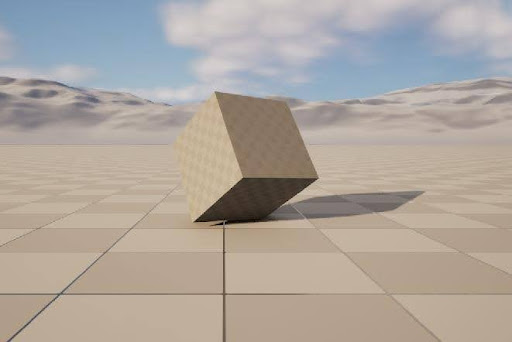
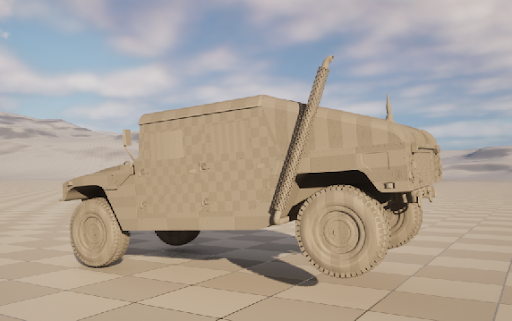

<div style="margin-bottom: 4rem;"></div>

## Current Research

### Neural Rendering for Object Caoture and Analysis

```{=html}
<div style="display: grid; grid-template-columns: 1fr 1fr; grid-template-rows: auto auto; column-gap: 2rem; row-gap: 2rem; margin: 2rem 0; max-width: 1200px;">
  <div style="grid-row: 1 / 3;">
    
    <p class="image-caption">Feather Gaussian Splat (30k iterations)</p>
  </div>
  <div>
    <video style="width: 100%; border-radius: 8px; box-shadow: 0 4px 6px rgba(0,0,0,0.1);" autoplay loop muted playsinline>
        <source src="./images/FeatherTestGS.mp4" type="video/mp4">
        Your browser does not support the video tag.
    </video>
    <p class="image-caption">Gaussian Splat Full View</p>
  </div>
  <div>
    
    <p class="image-caption">Variable Illumination Sphere (VarIS)</p>
  </div>
</div>
```   
<div style="margin-bottom: 2rem;"></div>

**Advisor:** Dr. Eric Patterson | Clemson University   
**Topics:** Gaussian Splatting, Machine Learning, Material Capture, Facial Analysis   

<div style="margin-bottom: 2rem;"></div>

As a possible avenue for my dissertation, I am currently exploring neural inference techniques to improve vertex initialization in 3D Gaussian Splatting for facial and object reconstruction. This work focuses on leveraging multi-view feature detection to establish consistent point correspondences without the need for COLMAP algorithms that could be too expensive or incorrect.

In the preliminary stages of our work, we were able to capture and render a Gaussian Splat model of this feather using Agisoft MetsShape to export COLMAP data. In total it took three days to render, 30,000 iterations, and over one million gaussians were left to be rasterized. Not only does this show remarkable possibility, it gives us a baseline to compare our future method that bypasses COLMAP.


<div style="margin-bottom: 4rem;"></div>

## Research Experience


### Tracked Vehicle Simulations in Unreal Engine 5 and Project Chrono
**Research Assistant** | January 2025 - September 2025   
**Project:** VIPR-GS (Virtual Prototyping of Autonomy-Enabled Ground Systems)   
**Collaborators:** Dr. Eric Patterson, Dr. Gregory Mocko, William Luttrell

This work continues research with Project Chrono and Unreal Engine implementations to extend the technology towards tracked vehicle analysis.  

---

### Extensible Real-Time Prototyping Framework within Unreal Engine
**Research Assistant** | February 2024 - February 2025
**Project:** VIPR-GS (Virtual Prototyping of Autonomy-Enabled Ground Systems)
**Collaborators:** Dr. Eric Patterson

Developing real-time simulation and visualization tools for autonomous ground vehicle prototyping, briding high-fidelity physics simulation with interactive 3D environments.  


```{=html}
<div style="display: grid; grid-template-columns: 1fr 1fr; gap: 1.5rem; margin: 2rem 0;">
    <div>
        
        <p class="image-caption">Primitive Project Chrono Simulation</p>
    </div>
    <div>
        
        <p class="image-caption">Full Project Chrono Vehicle Simulation</p>
    </div>
</div>
```


**Technical Contributions:**  

- **Middleware architecture:** Designed and implemented C++ and Python mideleware, enabling bidirectional communication between Project Chrono and Unreal Engine via UDP protocol.
- **Physics-informed neural network (PINNs) framework:** Began developing a hybrid neural network model to accelerate wheeled vehicle dynamics while maintaining physical accuracy and reducing computational overhead for real-time applications (due to the project's end date, this work is left unfinished).

**Technologies:** C++, Python, Unreal Engine 5, Project Chrono, PyTorch, UDP networking